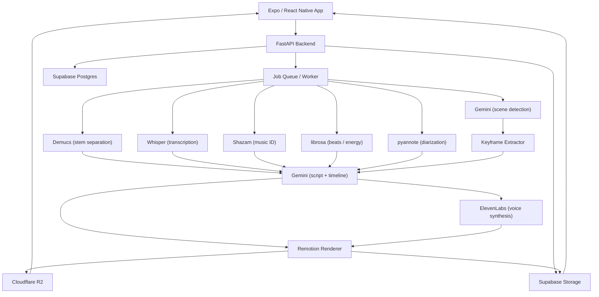

# Reelize Architecture

Reelize is an AI-powered short-form video generation platform. Users provide a reference video (YouTube Short, TikTok, Reel), the backend analyzes its audio/visual style, and generates a new video matching those characteristics.

*Made with [Canvas Cloud AI](https://canvascloud.ai) — AI-powered cloud architecture diagramming*

## Components

- **Client** — Expo / React Native app (mobile + web) for upload, previewing, and downloading generated videos.
- **Backend API** — FastAPI server that orchestrates jobs, serves signed URLs, and manages state in Supabase.
- **Job Queue / Worker** — Serialized background worker that runs the analysis and render pipeline, preventing GPU/memory contention.
- **Audio Pipeline** — Demucs (stem separation), Whisper (transcription), Shazam (music ID), librosa (beat grid + energy envelope), and pyannote (speaker diarization).
- **Video Analyzer** — Gemini-powered scene detection with multi-pass keyframe refinement.
- **Script Generation** — Gemini produces the script and timeline from the combined audio/video manifest.
- **Voice Synthesis** — ElevenLabs generates narration from the script.
- **Renderer** — Remotion (React-based video framework) composes the final video with layered audio, voice, and footage.
- **Storage** — Supabase Postgres for job state and metadata; Supabase Storage / Cloudflare R2 for media assets and final renders.

## Data Flow

1. User uploads or links a reference video from the client.
2. FastAPI creates a job and enqueues it for the worker.
3. Audio and video analysis pipelines run in parallel, writing results into a shared manifest.
4. Gemini consumes the manifest to generate a script and shot timeline.
5. ElevenLabs synthesizes voice audio for the script.
6. Remotion renders the final composition with voice, music, and selected footage.
7. The output is stored and returned to the client via a signed URL.
